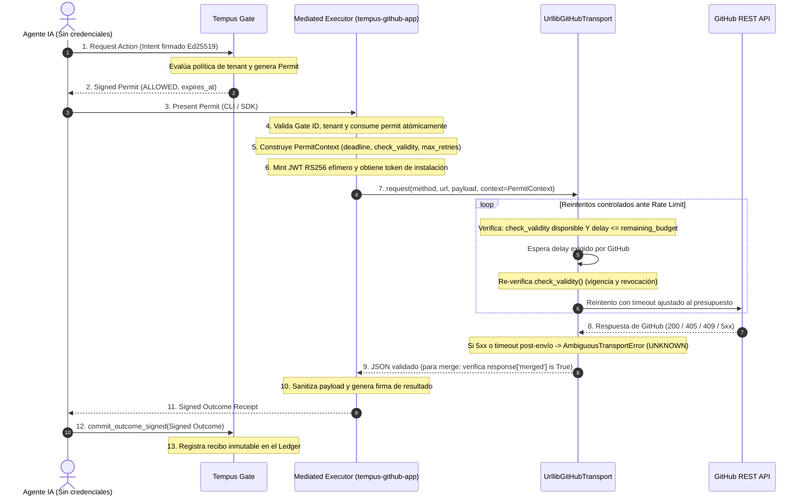

# Plan de Implementación: Ampliación de Acciones y Resiliencia en Tempus GitHub App (Definitivo)

## 🎯 Descripción del Objetivo
Evolucionar **`tempus-github-app`** para ampliar la superficie de acciones de agentes autónomos e incorporar resiliencia ante límites de tasa de GitHub, **preservando los invariantes mediante validaciones y pruebas**:

1. **Ampliación de la Superficie de Acciones (`ActionAdapter`):**
   - Incorporar 4 nuevas acciones seguras:
     - `github.add_comment`: Comentarios conversacionales en hilos de issues y pull requests.
     - `github.add_labels`: Asignación de etiquetas a issues/PRs.
     - `github.merge_pull_request`: Fusión de pull requests con SHA de 40 caracteres obligatorio y permiso `contents: write`.
     - `github.request_review`: Solicitud de revisión de código a usuarios o equipos.

2. **Resiliencia de Red y Throttling con Presupuesto Temporal Estricto:**
   - Detección de `429 Too Many Requests` y `403` por *secondary rate limit* / abuso.
   - Contrato formal de paso de contexto del permiso verificado desde el ejecutor hacia el transporte.
   - **`check_validity` obligatorio para reintentar escrituras:** Si no se puede verificar vigencia y no-revocación, no hay reintentos.
   - Respeto íntegro de la espera exigida por GitHub (sin recortes artificiales). Si la espera excede el presupuesto del permiso, abortar *fail-closed*.

---

## 🔒 Invariantes de Seguridad Fundamentales

> [!IMPORTANT]
> 1. **Zero Credential Leakage:** Ni la clave privada RSA (`.pem`) ni los tokens de instalación de 1 hora escapan al agente ni a los recibos de auditoría de Tempus.
> 2. **Consumo Atómico y Unicidad:** Cada permiso se consume de forma transaccional en la base de datos local SQLite antes de contactar a GitHub.
> 3. **Fail-Closed en Configuración de Seguridad:** Si se suministra `gate_db` para verificación de revocación y el runtime no lo soporta, el ejecutor debe fallar explícitamente en la inicialización.
> 4. **No-Mutación Durante Espera (Reintentos de Escritura):**
>    - Para reintentar una petición de escritura tras un rate limit, la comprobación de `check_validity` es **obligatoria**. Si no se dispone de verificación activa de revocación y vigencia, no se realizan reintentos.
>    - Si el tiempo de espera exigido por GitHub (`Retry-After`) supera el tiempo restante de vida del permiso (`expires_at - now`), la ejecución se detiene de inmediato.
>    - Tras despertar del sleep y antes de enviar bytes a GitHub, se verifica nuevamente que el permiso siga vigente y no esté revocado.
> 5. **Semántica de Resultados Ambiguos:** Tiempos de espera agotados tras el envío de la petición, caídas de red a mitad de camino o respuestas HTTP 5xx marcan la ejecución local como `UNKNOWN`. **Bajo ninguna circunstancia se reintentan escrituras automáticamente ante ambigüedad**. La reconciliación del estado real en GitHub es un proceso independiente de solo lectura.

---

## 🔐 Política de Autorización y Gobernanza del Merge

El SHA de 40 caracteres fija el commit exacto, pero la autorización de fusionarlo depende de la política criptográfica del Tempus Gate:
1. **Identidad Autorizada:** El `agent_id` solicitante debe poseer un rol explícito de integración o *release manager* en la política del tenant.
2. **Aprobación Humana Obligatoria (*Human-in-the-Loop*):**
   - Para ramas protegidas (e.g. `main`), la política del Gate exige una firma dual o aprobación humana explícita previa a la emisión del permiso.
   - El permiso firmado por el Gate ata criptográficamente:
     - `resource`: Repositorio exacto (`owner/repo`).
     - `input.pull_number`: Número de PR específico.
     - `input.sha`: SHA de 40 caracteres del commit HEAD auditado.
     - `input.merge_method`: Método autorizado (`merge`, `squash`, `rebase`).
3. **Validación en Ejecutor:** El ejecutor rechaza *fail-closed* si los parámetros recibidos no coinciden estrictamente con los autorizados en el permiso firmado.

---

## 🏗️ Flujo del Protocolo B2A y Contrato de Contexto

---

## 📋 Fases de Implementación en Orden Riguroso

### Fase 1: Compatibilidad de Revocación y Fail-Closed en `gate_db`
- **Archivo:** `src/tempus_github_app/executor.py`
- **Cambio:** Si el operador proporciona `gate_db` y el runtime subyacente de `tempus_ddb` no acepta el argumento en su inicializador, **lanzar `GitHubExecutorError` de inmediato** en lugar de omitirlo silenciosamente.
- **Tests en `tests/test_executor.py`:**
  - Inicialización con `gate_db` incompatible provoca fallo *fail-closed*.

---

### Fase 2: Acciones `add_comment`, `add_labels` y `request_review`
- **Archivos:** `src/tempus_github_app/credentials.py`, `src/tempus_github_app/executor.py`
- **Mapeo de permisos:**
  - `github.add_comment`: `"issues"` (`issues: write`)
  - `github.add_labels`: `"issues"` (`issues: write`)
  - `github.request_review`: `"pull_requests"` (`pull_requests: write`)
- **Validaciones de entrada:**
  - `github.add_comment`: `issue_number` entero > 0, `body` string no vacío de máx **65,536 caracteres** (*fail-fast* ante límites de GitHub). Docstring explícito indicando que es un comentario a nivel de hilo (válido para Issues y PRs).
  - `github.add_labels`: `issue_number` entero > 0, `labels` lista no vacía de strings no vacíos.
  - `github.request_review`: `pull_number` entero > 0, al menos uno de `reviewers` o `team_reviewers` con lista no vacía de strings.
- **Sanitización de salida:**
  - Mapeo seguro de campos devueltos y soporte para respuestas en lista (`labels`).
- **Tests:** Tests de validación estricta de campos, rechazo de campos desconocidos y respuestas sanitizadas.

---

### Fase 3: Reintentos con Presupuesto Temporal y Contrato de Contexto
- **Archivo:** `src/tempus_github_app/transport.py`
- **Contrato Runtime → Adaptador → Transporte:**
  - Definición de clase `PermitContext`:
    - `deadline: float`: Timestamp UNIX de expiración del permiso.
    - `check_validity: Callable[[], bool]`: Función que verifica vigencia y consulta revocación en `gate_db`.
    - `max_retries: int = 3`: Límite máximo de reintentos.
- **Regla estricta de reintentos para escrituras:**
  - Si `check_validity` es `None` o no está disponible: **NO se reintenta**. Se lanza `GitHubRateLimitError` inmediatamente.
  - Si `Retry-After` es mayor que `deadline - clock()`: **NO se recorta la espera**; se aborta inmediatamente.
  - Si no hay cabecera de espera ante límite secundario (403 abuso), considerar el mínimo recomendado por GitHub (60s). Si 60s excede el presupuesto, abortar *fail-closed*.
  - Tras la espera, evaluar `check_validity()`. Si el permiso expiró o fue revocado, abortar.
  - Timeout por petición de socket ajustado dinámicamente a `min(30.0, max(1.0, deadline - clock()))`.
- **Diferenciación estricta de `403`:**
  - `403` por falta de permisos: Error determinista inmediato (`status="FAILED"`), sin reintento.
  - `403` por abuso/rate limit: Solo reintentar si el presupuesto lo permite y `check_validity` está activo.
- **Tests en `tests/test_transport_resilience.py`:**
  - Reintento exitoso con presupuesto suficiente.
  - Aborto inmediato si `check_validity` no está presente.
  - Aborto cuando `Retry-After` excede el presupuesto del permiso.
  - Aborto cuando el permiso es revocado durante la espera.
  - Verificación de timeout y error 5xx traduciéndose en `AmbiguousTransportError` sin reintentos.

---

### Fase 4: Acción `merge_pull_request` con `contents: write` y SHA Obligatorio
- **Archivos:** `manifest/app.yml`, `src/tempus_github_app/credentials.py`, `src/tempus_github_app/executor.py`
- **Permiso en Manifiesto:**
  - En `manifest/app.yml`: Añadir `contents: write` en `default_permissions`.
  - En `credentials.py`: Mapear `"github.merge_pull_request": "contents"`.
- **Validación del SHA:**
  - El parámetro `sha` es **estrictamente obligatorio** y debe cumplir con una expresión regular exacta de 40 caracteres hexadecimales: `^[0-9a-fA-F]{40}$`.
  - Parámetros adicionales: `pull_number` (int > 0), `commit_title` (str opcional), `commit_message` (str opcional), `merge_method` (`merge`, `squash`, `rebase`).
- **Verificación rigurosa de respuesta HTTP 200:**
  - No fabricar `merged: true` solo por recibir HTTP 200.
  - Se debe validar explícitamente que el JSON de respuesta contenga `response.get("merged") is True`.
  - Si no contiene `merged: true`, la ejecución debe marcarse como `FAILED`.
- **Clasificación determinista de códigos de error:**
  - `405 Method Not Allowed`: `FAILED` con mensaje de PR no fusionable.
  - `409 Conflict`: `FAILED` con mensaje de commit HEAD desincronizado.
- **Documentación:**
  - Documentar en `README.md` y `docs/SETUP.md` el requisito de `contents: write` y la necesidad de aceptar los nuevos permisos en instalaciones previas de la GitHub App.

---

## 🧪 Plan de Verificación

### Avance: fase 3 implementada

- `PermitContext` y reintentos acotados implementados en el transporte, con comprobación de vigencia y revocación antes de cada envío, espera íntegra y protección mediante reloj monotónico.
- El puente local `permit_context.py` se invoca desde el callback del runtime después de la verificación y el consumo atómico. Extrae la expiración firmada en microsegundos y consulta SQLite en modo de solo lectura, sin modificar la dependencia `tempus-ddb`.
- Sin `gate_db` no hay reintentos. Fallos de consulta, revocación del permiso o de la identidad y resultados ya registrados en el Gate impiden nuevos envíos.
- Ajuste conservador del presupuesto: con menos de un segundo disponible se aborta, evitando que el mínimo de un segundo del timeout exceda la vigencia restante. El timeout de socket no garantiza la finalización de una operación remota antes de expirar.
- Verificación local: **160 pruebas aprobadas**, incluido el harness de conformidad; `ruff check .` sin errores. La matriz remota de nueve entornos no se ha ejecutado en esta sesión.
- Fase 4 implementada: `github.merge_pull_request` exige SHA hexadecimal de 40 caracteres y método explícito, usa `contents: write` y solo confirma éxito con `merged: true`. HTTP 405 y 409 producen recibos `FAILED`.
- Se documentaron la aceptación de nuevos permisos en instalaciones previas y las responsabilidades de gobernanza del Gate (rol y aprobación humana); esta implementación no configura políticas de tenants externos.
- Verificación final local de las cuatro fases: **204 pruebas aprobadas**, incluido el harness de conformidad para merge, y `ruff check .` sin errores. Matriz remota de CI pendiente de ejecución.

1. **Automated Tests:**
   - `pytest tests/ -v`: Suite completa con tests unitarios y de integración.
   - Tests de resultados ambiguos: timeout post-envío, HTTP 500 y fallo de conexión generando `UNKNOWN` sin repetición de escrituras.
   - Conformance harness de `tempus-ddb` en verde.
2. **Linting:**
   - `ruff check .`
3. **CI Pipeline:**
   - Verificación en los 9 entornos de GitHub Actions (Ubuntu, Windows, macOS x Python 3.10, 3.11, 3.12).
